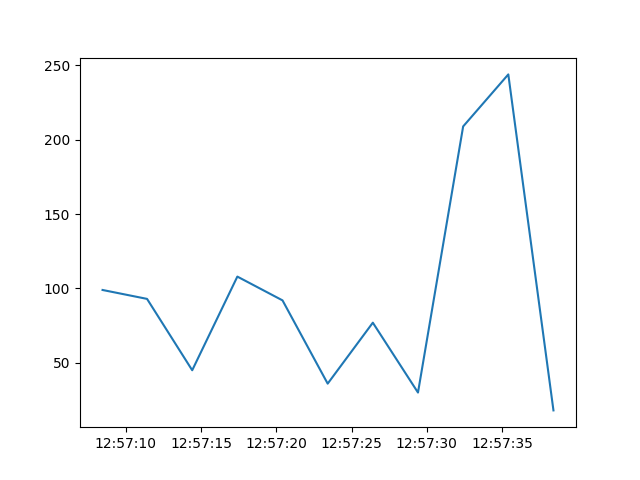

.. _hdbpp-with-docker-compose:

====================================================
How to spin-up a HDB++ archiver using docker compose
====================================================

`Docker compose <https://docs.docker.com/compose/>`_ and the images produced by
this repository can be used to spin-up a basic HDB++ archiver for
experimentation.

This how-to provides a docker compose file you can use to startup the necessary
HDB++ device servers to be able to archive data from Tango devices.

As an example, the docker compose also starts a TangoTest device, configures
the archive to collect data from this device and shows how to collect data from
the archive using `pyhdbpp
<https://gitlab.com/tango-controls/hdbpp/libhdbpp-python/>`_.

Create the docker compose configuration
---------------------------------------

This section describes the files you need to create in order to start the HDB++
instance.  The docker compose file will use
:ref:`ska-tango-images-tango-dsconfig` to configure the Tango database and
:ref:`ska-tango-images-hdbpp-yaml2archiving` to configure the HDB++ archiver.

- Step 1: Save the following as :download:`compose.yaml
  <../../gen/how-to-hdbpp-with-docker-compose/compose.yaml>`:

.. literalinclude :: ../../gen/how-to-hdbpp-with-docker-compose/compose.yaml
   :language: yaml

.. tip::

   This docker compose file includes a Tango database, similar to that described
   in :ref:`basic-docker-compose`.  If you want to be able to control the
   startup of the Tango database separately from the startup of HDB++, remove
   the ``tango-db`` and ``tango-dbds`` services from this ``compose.yaml``, set
   the ``tango-net`` network to be ``external: true`` and use the
   ``compose.yaml`` described in :ref:`basic-docker-compose`.

- Step 2: Create the configuration file for
  :ref:`ska-tango-images-tango-dsconfig`  by saving the following file as
  :download:`tango.json <../../gen/how-to-hdbpp-with-docker-compose/tango.json>`:
  in the same directory as your ``compose.yaml``:

.. literalinclude :: ../../gen/how-to-hdbpp-with-docker-compose/tango.json
   :language: json

.. note ::

   Here we do not include the ``TangoTest`` device because this is included by
   default in the :ref:`ska-tango-images-tango-db` OCI image.

- Step 3: Create the configuration file for
  :ref:`ska-tango-images-hdbpp-yaml2archiving` by saving the following file as
  :download:`archive.yaml <../../gen/how-to-hdbpp-with-docker-compose/archive.yaml>`:
  in the same directory as your ``compose.yaml``:

.. literalinclude :: ../../gen/how-to-hdbpp-with-docker-compose/archive.yaml
   :language: yaml

.. warning::

   The ``TangoTest`` device does not manually push archive events for the
   ``short_scalar_ro`` attribute.  This configuration here will enable the Tango
   polling for this device.  If your device *does* manually push archive events
   you do not need to set the ``polling_period``.

Start the HDB++ device servers
------------------------------

To start the Tango environment, run the following from the directory
containing ``compose.yaml``:

.. code-block:: bash

   docker compose up -d

After a brief startup time, the Tango database should now be available at
``TANGO_HOST=localhost:10000`` and the HDB++ TimescaleDB database should be
available at ``localhost:5432``.

Extracting data from the archiver
---------------------------------

This section describes how to extract data from the archiver using `pyhdbpp
<https://gitlab.com/tango-controls/hdbpp/libhdbpp-python/>`_.

The HDB++ archiver will be archiving the ``short_scalar_ro`` attribute from the
``sys/tg_test/1`` device.

- Step 1: in a virtual environment run the following to install the required
  dependencies:

.. code-block:: bash

    pip install --require-virtualenv pyhdbpp psycopg2-binary matplotlib

- Step 2: run the following python script:

.. code-block:: python

    import pyhdbpp
    import matplotlib.pyplot as plt
    import numpy as np
    from datetime import datetime, timedelta

    rd = pyhdbpp.reader(apiclass="pyhdbpp.timescaledb.TimescaleDbReader", config="postgres:tango@localhost:5432/hdb")
    yesterday = datetime.strftime(datetime.now() - timedelta(1), "%Y-%m-%d")
    values = np.array(rd.get_attribute_values("sys/tg_test/1/short_scalar_ro", yesterday))
    plt.plot(values[:, 0], values[:, 1])
    plt.savefig("short_scalar_ro.png")

This will save a plot called "short_scalar_ro.png" of the ``short_scalar_ro``
attribute since yesterday.  The ``short_scalar_ro`` attribute changes randomly,
however, you should produce something similar to the following plot:

Stopping the Tango environment
------------------------------

The Tango environment and archiver can be stopped by running the following from the directory
containing ``compose.yaml``:

.. code-block:: bash

   docker compose down

.. note::

   Once the Tango environment is stopped, all archive data will be lost.  In
   order to preserver the archive data you must mount a data directory into the
   ``archive-db`` image.  See the `Docker Volumes documentation
   <https://docs.docker.com/engine/storage/volumes/>`_ for details.
